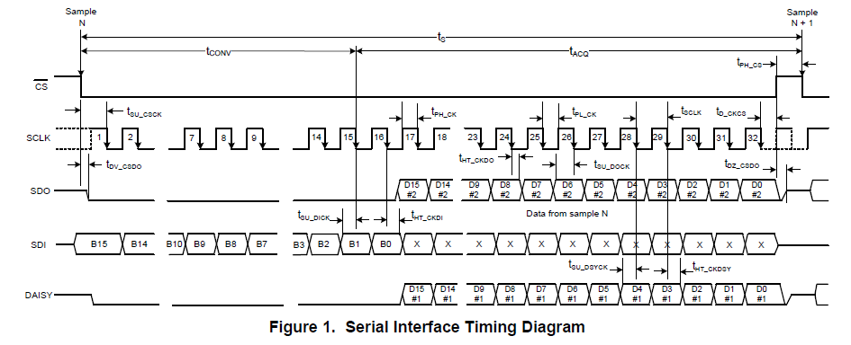
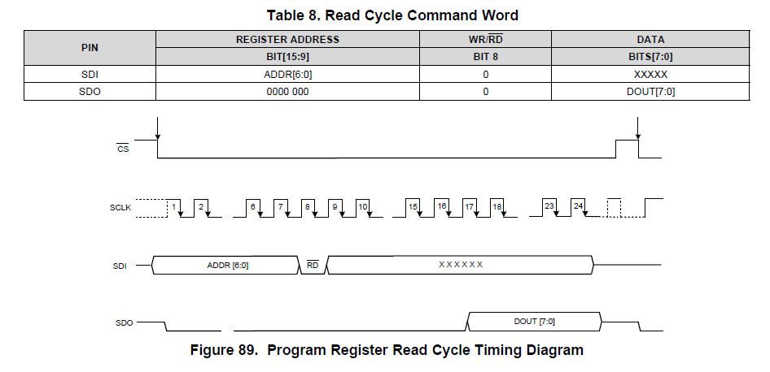
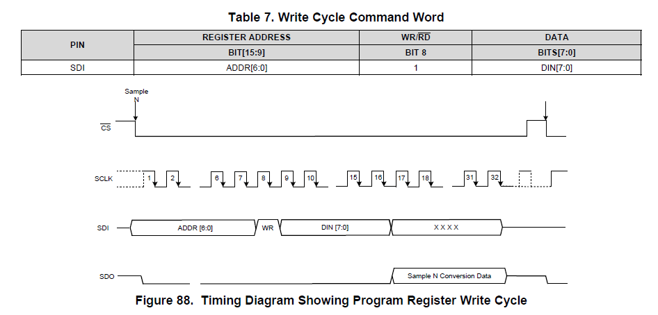
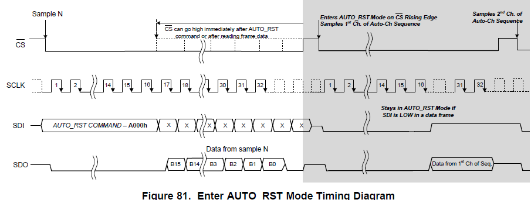
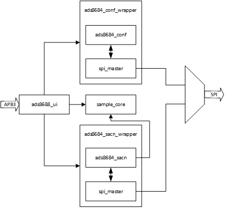
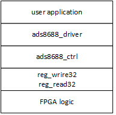

# ADS8688 应用指南 (软件驱动)

## 操作时序

1. SPI 时序

   

   操作模式为 SCLK 上升沿发送下降沿采样（CPOL = 1,CPHA=0; CPOL=0,CPHA=1）

   SPI 时钟速率最高为 17MHz，对应采样率最高 500KSPS

   CS 拉低后到第一个数据采样边沿最小为 30ns，即 CS 至少提前半个 SCLK 时钟周期

   最后一个采样沿后 CS 保持低电平最小时间为 30ns，即 CS 至少保持半个 SCLK 时钟周期

2. 寄存器读时序

   

   读操作最少要传输 24 个比特位，先发 7 位地址和 1 位读标志，再传输 16 位占位数据，读取的数据将在第 17~24 位出现在 SDO 上

3. 寄存器写时序

   

   写操作最少要传输 16 个比特位，先发 7 位地址和 1 位写标志，再传输 8 位写数据，随后的采样点输出部分不需要关心

4. 命令时序

   

   命令时序其实和写时序是一样的

根据上面的时序图可以将所有时序统一定义成四字节传输的 SPI, 写命令可以看作数据为 0 的寄存器写操作

## 命令/寄存器介绍

|                | 命令         | 地址      | 说明                                                                         |
| -------------- | ------------ | --------- | ---------------------------------------------------------------------------- |
| NO_OP          | 无操作       | 0x00      | 不进行新的操作，主要在手动选择或者自动扫描时使用，用来继续进行数据转换和采样 |
| STDBY          | 待机         | 0x82      | 进入待机模式后不会进行采样                                                   |
| PWR_DN         | 掉电         | 0x83      | 进入掉电模式以节省电源消耗                                                   |
| RST            | 复位         | 0x85      | 执行复位操作                                                                 |
| AUTO_RST       | 自动重置     | 0xA0      | 按照所编程的通道使能状态执行自动扫描                                         |
| MAN_Ch_n       | 手动选择     |           | 手动选择指定通道                                                             |
| -------------- | ------------ | --------- | ----------------------------------------------------                         |
| CH_EN          | 通道扫描使能 | 0x01      | 使能指定通道，在使用自动扫描时根据需要配置                                   |
| CH_PD          | 通道掉电     | 0x02      | 关闭指定通道                                                                 |
| FEATURE_SELECT | 特性选择     | 0x03      | 用于配置菊花链连接时 SPI 输出数据格式和器件地址                              |
| RANGE_SELECT_n | 范围选择     | 0x05-0X0C | 用于配置期间内部可编程增益运放，调整输入电压量程范围                         |

**读写入寄存器时，需要将地址左移一位，将读写标志放在最低位，命令不需要**

## 一般编程顺序

1. 初始化 SPI

2. 写入复位命令 RST 以复位设备

3. 设置输入量程范围 RANGE_SELECT_n

4. 设置 通道使能 CH_EN 和 通道掉电 CH_PD

5. 通过 AUTO_RST 或 MAN_Ch_n 执行采样

## 参考 FPGA 程序

## 参考 C 驱动程序

